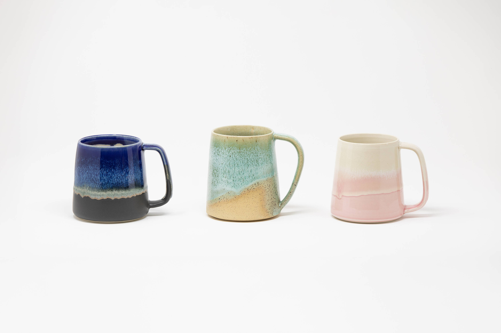

# Food Safe Glaze Info & Care Instructions | Artisanal Arsonist Pottery

_Source_: <https://www.artisanalarsonistpottery.com/food-safe-glaze-info-and-care-instructions>

###### Conscious Craftsmanship

## Food Safe Glaze Info & Caring for your Pottery

Only food-safe glazes are used on my pottery’s food surfaces. I do not use any lead.

This is something I take great pride in.

I inspect each item to ensure the glaze was fired optimally.

This pottery is thrown using Canadian clay, and fired to 1204C / 2200 F. When cared for well, pottery of this quality can last decades and be passed down for generations. I hope you will enjoy these pieces for years and years, and therefore I recommend hand-washing, and not leaving your pottery to sit/soak for long periods of time as all clay (even factory-made dishes) will absorb moisture over time.

Hand-wash your beautiful pottery and it will serve you many years of enjoyment.

View the Gallery

Home

## Images

## Site links

- <https://www.artisanalarsonistpottery.com/>
- <https://www.artisanalarsonistpottery.com/about>
- <https://www.artisanalarsonistpottery.com/contact>
- <https://www.artisanalarsonistpottery.com/gallery>
- <https://www.artisanalarsonistpottery.com/markets-events>
- <https://www.artisanalarsonistpottery.com/shop>
